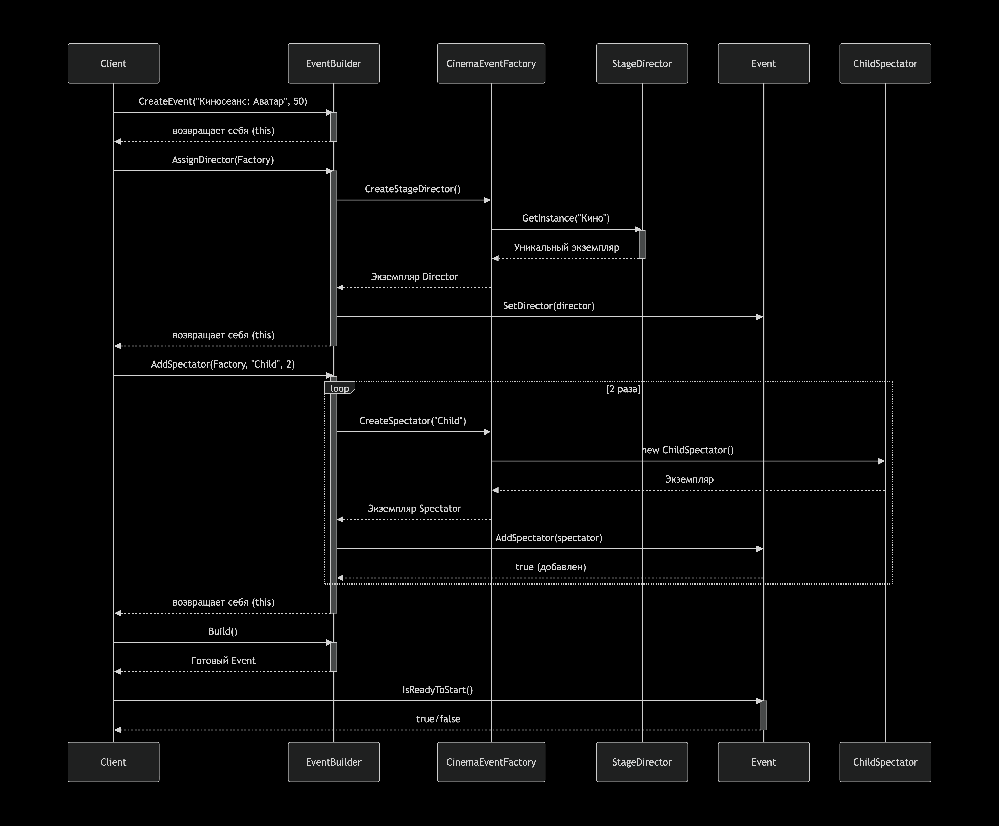

Моя адаптация: Кино и Театр

Создадим объекты:
1. Киносеанс и Спектакль.
2. Режиссер. Режиссер может быть только один на один показ/постановку.
3. Зрители. Для каждого типа мероприятия у зрителей свои требования.

Лимиты загрузки:

Для Киносеанса: зал вмещает 50 человек. Типы зрителей: Взрослый, Студент (льготный), Ребенок. Для детей нужны особые условия (например, подушки-бустеры).

Для Спектакля: зал вмещает 30 человек. Типы зрителей: Взрослый, Пенсионер (льготный), Ребенок. Для детей нужны особые условия.

Паттерны в моем решении
Singleton (Одиночка): Класс Режиссер (StageDirector). В каждый сеанс может быть только один режиссер.

Abstract Factory: Фабрики для создания "команды" мероприятия:

CinemaEventFactory: создает режиссера для кино, зрителей для кино.

TheaterEventFactory: создает режиссера для театра, зрителей для театра.

Builder: Класс EventBuilder, который пошагово конструирует событие (Event):

Шаг 1: Создать пустое событие.

Шаг 2: Назначить режиссера (Singleton).

Шаг 3: Добавить зрителей (с проверкой лимитов и типов).

Шаг 4: Вернуть готовый объект события.

UML-диаграммы 

